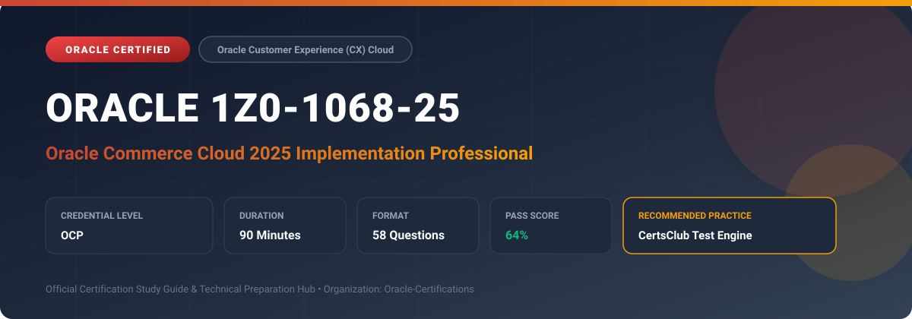

  

# Oracle 1Z0-1068-25: Oracle Commerce Cloud 2025 Implementation Professional

[_Cloud-red?style=for-the-badge)](https://education.oracle.com/)

---

## 1. Exam Overview & Candidate Profile

The **Oracle 1Z0-1068-25: Oracle Commerce Cloud 2025 Implementation Professional** examination is designed for cloud professionals, enterprise architects, implementation consultants, and systems administrators who demonstrate deep practical knowledge and operational competence in deploying, configuring, and optimizing Oracle technologies.

The Oracle Commerce Cloud 2025 Implementation Professional (1Z0-1068-25) certification confirms expertise in deploying and maintaining modern B2B and B2C digital commerce solutions on Oracle Commerce Cloud. The exam tests skills in catalog management, price groups, storefront widget design, promotions, guided search & navigation, payment integrations, and agent console operations.

### Target Audience & Prerequisites
- **Target Roles**: Implementation Consultants, Cloud Solution Architects, DevOps/SysOps Engineers, and Enterprise Functional Analysts.
- **Recommended Experience**: 1–2 years of hands-on experience in configuring, administering, or implementing the relevant Oracle solutions.
- **Credential Earned**: Oracle Certified Professional (OCP).

---

## 2. Key Exam Specifications

| Specification | Details |
| :--- | :--- |
| **Exam Code** | **Oracle 1Z0-1068-25** |
| **Official Title** | Oracle Commerce Cloud 2025 Implementation Professional |
| **Certification Track** | Oracle Customer Experience (CX) Cloud |
| **Exam Duration** | 90 Minutes |
| **Number of Questions** | 58 Questions |
| **Passing Score** | 64% |
| **Question Format** | Multiple Choice (Single/Multiple Answer), Scenario-Based Questions |
| **Delivery Provider** | Oracle University / Pearson VUE (Online Proctored or Test Center) |
| **Recommended Practice Engine** | [CertsClub Oracle Practice Tests](https://www.certsclub.com/oracle/1z0-1068-25-dumps.html) |

---

## 3. Official Blueprint & Exam Domain Breakdown

The examination assesses candidate competencies across core functional domains weighted as follows:

| Domain Area | Weighting |
| :--- | :--- |
| **Commerce Platform Architecture & Settings** | `15%` |
| **Catalog, Products, & Price Group Management** | `25%` |
| **Design Studio & Storefront Widget Development** | `20%` |
| **Search, Guided Navigation, & Promotions Engine** | `20%` |
| **Checkout, Payment Gateways, & Order Fulfillment** | `20%` |

---

## 4. Deep Dive into Complex & Challenging Technical Topics

To secure a passing score on the 1Z0-1068-25 exam, candidates must master the following advanced concepts:

- Configuring multi-site storefronts with localized currencies, languages, and site-specific catalog hierarchies.
- Developing custom Knockout.js and JavaScript storefront widgets using Commerce Cloud Design Studio APIs.
- Setting up complex promotions, volume-tiered discounts, coupon batches, and shipping calculation methods.
- Integrating third-party payment gateways, webhook events for order capture, and tax calculation engines (e.g., Vertex).

---

## 5. Scenario-Based Demo & Practice Questions

### Question 1
In Oracle Commerce Cloud, which capability enables businesses to serve distinct storefront branding, independent product selections, and separate currencies from a single administrative instance?

A) Multi-Site Architecture
B) Multiple Master Tenants
C) Container Clones
D) Custom Reverse Proxy

- **Correct Answer**: `A) Multi-Site Architecture`
- **Technical Explanation**: Oracle Commerce Cloud's Multi-Site architecture allows deploying multiple distinct B2B or B2C storefronts sharing a single administration environment and product catalog repository.

---

### Question 2
What frontend JavaScript framework is natively used by Oracle Commerce Cloud Design Studio for binding data to UI elements in storefront widgets?

A) React.js
B) Angular
C) Knockout.js
D) Vue.js

- **Correct Answer**: `C) Knockout.js`
- **Technical Explanation**: Oracle Commerce Cloud's storefront architecture traditionally leverages Knockout.js for two-way declarative data binding between widget JavaScript viewmodels and HTML templates.

---

## 6. Recommended Preparation Strategy & Practice Testing Engine

Achieving certification in **Oracle 1Z0-1068-25** requires balanced theoretical study and scenario-based simulation practice:

1. **Review Oracle Documentation**: Master architecture guides, implementation workbooks, and administration manuals on the Oracle Help Center.
2. **Hands-on Lab Practice**: Execute real-world configuration, policy setup, and troubleshooting tasks in your cloud tenancy or test instance.
3. **Simulated Exam Drills**: Practice answering timed, scenario-based multiple-choice questions to familiarize yourself with the question formats, traps, and timing constraints.

### Practice With CertsClub
For realistic practice questions, updated dumps, and mock testing environments:
- **Resource**: [CertsClub Oracle Practice Test Engine](https://www.certsclub.com/oracle/1z0-1068-25-dumps.html)
- **Special Discount**: Use coupon code **`club20`** during checkout for an instant **20% discount** on all practice exam bundles and testing engines.

---

## 7. Official Documentation & References

- [Oracle University Certification Registry](https://education.oracle.com/)
- [Oracle Help Center Documentation Portal](https://docs.oracle.com/)
- [Oracle Cloud Infrastructure & Applications Guides](https://docs.oracle.com/en/cloud/)
- [CertsClub Oracle Certification Exam Practice](https://www.certsclub.com/oracle/1z0-1068-25-dumps.html)

---

## 8. SEO & Discovery Keywords

`oracle 1z0-1068-25`, `oracle 1z0-1068-25 exam`, `oracle 1z0-1068-25 dumps`, `1Z0-1068-25 practice questions`, `1Z0-1068-25 study guide`, `oracle 1z0-1068-25 syllabus`, `oracle commerce cloud 2025 implementation professional`, `certsclub 1z0-1068-25`